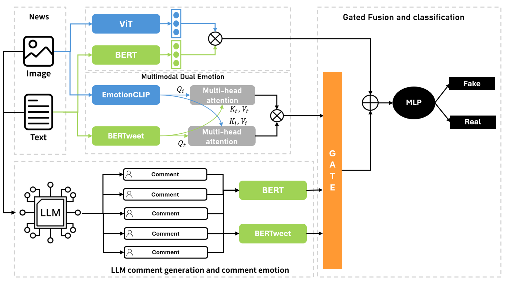

# Multimodal Fake News Early Detection via Emotion-Aware LLM-Generated Social Responses

This repository contains the implementation of **Multimodal Fake News Early Detection via Emotion-Aware LLM-Generated Social Responses**. The model is designed for early fake news detection, where real user comments are often missing or limited. To address this problem, the framework generates social responses using a large language model (LLM), extracts emotional cues from the generated comments, and combines them with news text, news image, and multimodal emotion features through a gated fusion module.

The implementation supports experiments on **Fakeddit** and **MMFakeBench**.

- Fakeddit: https://github.com/entitize/Fakeddit
- MMFakeBench: https://github.com/liuxuannan/MMFakeBench

## Model architecture



The proposed framework consists of four main components:

1. **Input feature encoding**
   - News text is encoded using `bert-base-uncased`.
   - News images are encoded using `google/vit-base-patch16-224-in21k`.
   - The text and image representations form the base branch of the model.

2. **Multimodal dual emotion**
   - Text emotion is extracted using a BERTweet-based emotion classifier.
   - Image emotion is extracted using EmotionCLIP-based image emotion features.
   - Text and image emotion vectors are projected into a shared space and fused using bidirectional multi-head cross-modal attention.

3. **LLM-generated social response modeling**
   - An LLM generates five social-user-style comments for each news sample.
   - Generated comments are embedded using BERT.
   - Comment emotions are extracted using BERTweet.
   - Comment emotion statistics are represented using the mean and standard deviation of comment-level emotion probability vectors.

4. **Gated fusion and classification**
   - The base branch consists of news text and image features.
   - The auxiliary branch consists of generated comment features, multimodal dual emotion features, and comment emotion statistics.
   - Scalar gates control the contribution of each auxiliary feature.
   - The gated auxiliary branch is added to the base branch through residual fusion and classified using an MLP.

## Repository structure

```text
journal_code_refactor/
├── main.py                         # Main training entry point
├── requirements.txt                # Minimal Python dependencies
├── run_train.sh                    # Example training script
├── README.md                       # Project documentation
├── assets/
│   └── model_architecture.png      # Proposed model structure
├── dataset/
│   ├── fakeddit/
│   │   ├── train.jsonl
│   │   ├── dev.jsonl
│   │   ├── test.jsonl
│   │   └── images/
│   └── MMFakeBench/
│       ├── MMFakeBench_train.jsonl
│       ├── MMFakeBench_val.jsonl
│       └── images/
├── model/
│   ├── __init__.py
│   ├── config.py                   # Command-line arguments
│   ├── dataset.py                  # Dataset and feature loading
│   ├── model.py                    # Proposed multimodal gated fusion model
│   ├── train.py                    # Training, validation, test, metrics, optimizer
│   └── utils.py                    # Reproducibility and file utilities
└── preprocess/
    ├── comment_generator.py        # LLM-based comment generation
    ├── comment_emotion.py          # Comment emotion extraction
    └── emotion.py                  # News text emotion extraction
```

## Installation

Create a Python environment and install the required packages.

```bash
pip install -r requirements.txt
```

The minimal dependency list is intentionally small. If you run preprocessing scripts that call a local LLM server, make sure `requests` is installed. If you use CUDA, install the PyTorch build that matches your CUDA version.

## Dataset preparation

### Fakeddit

Download the Fakeddit dataset from the official repository:

```text
https://github.com/entitize/Fakeddit
```

Expected layout:

```text
dataset/fakeddit/
├── train.jsonl
├── dev.jsonl
├── test.jsonl
└── images/
    ├── <sample_id>.jpg
    ├── <sample_id>.png
    └── ...
```

Each JSONL file should contain at least the following fields:

```json
{
  "id": "sample_id",
  "text": "news text",
  "2_way_label": 0
}
```

The default binary label format is:

```text
0 = fake
1 = real
```

### MMFakeBench

Download MMFakeBench from the official repository:

```text
https://github.com/liuxuannan/MMFakeBench
```

Expected layout:

```text
dataset/MMFakeBench/
├── MMFakeBench_train.jsonl
├── MMFakeBench_val.jsonl
└── images/
    ├── <image_name>.jpg
    ├── <image_name>.png
    └── ...
```

If the original MMFakeBench files use dataset-specific field names such as `image_path` or `gt_answers`, convert them into the unified JSONL format used by this codebase before training.

## Input feature files

The training code expects pre-extracted emotion and comment files.

### Text emotion CSV

Text emotion features should be stored in a CSV file with the following columns:

```text
id, emotion
```

The `emotion` column should contain a JSON-formatted dictionary with seven emotion probabilities:

```json
{
  "anger": 0.0,
  "joy": 0.0,
  "fear": 0.0,
  "sadness": 0.0,
  "disgust": 0.0,
  "surprise": 0.0,
  "neutral": 1.0
}
```

### Image emotion CSV

Image emotion features should be stored in a CSV file with an `id` column and the following nine emotion columns:

```text
amusement, anger, awe, contentment, disgust, excitement, fear, sadness, neutral
```

### Generated comments JSONL

The code supports either grouped comments per news sample:

```json
{
  "news_id": "sample_id",
  "comments": [
    {"comment": "This looks suspicious..."},
    {"comment": "No way this is real."}
  ]
}
```

or one comment per line:

```json
{"news_id": "sample_id", "comment": "This looks suspicious..."}
```

### Comment emotion CSV

Comment emotion features should be stored in a CSV file with the following columns:

```text
news_id, comment, emotion
```

The `emotion` column should follow the same seven-emotion JSON format as the text emotion file. During training, the model computes the mean and standard deviation of all comment emotion vectors for each news sample and uses the resulting 14-dimensional vector as comment emotion statistics.

## Preprocessing

### 1. Generate LLM comments

The script `preprocess/comment_generator.py` generates five comments per news sample using a local Ollama-compatible LLM server.

Example:

```bash
python preprocess/comment_generator.py \
  --data_dir dataset/fakeddit \
  --splits train dev test \
  --input_suffix .jsonl \
  --output_suffix _llm_comments.jsonl \
  --ollama_url http://localhost:11434 \
  --model qwen2.5vl \
  --temperature 0.7 \
  --top_p 0.9 \
  --resume
```

The prompt asks the LLM to simulate realistic social users and generate comments that implicitly express emotional reactions through wording, tone, punctuation, and style. The generated comments are not used as final labels; they are used as auxiliary social response signals.

### 2. Extract news text emotions

Use `preprocess/emotion.py` to extract BERTweet-based emotion probabilities for news text. This script produces text emotion files used by the training pipeline.

Before running it, check the path configuration at the top of the script and set the input and output paths for your dataset.

```bash
python preprocess/emotion.py
```

### 3. Extract comment emotions

Use `preprocess/comment_emotion.py` to extract BERTweet-based emotion probabilities for generated or real comments.

Before running it, check the path configuration at the top of the script and set the input comment JSONL file and output paths.

```bash
python preprocess/comment_emotion.py
```

## Training

### Fakeddit example

```bash
python main.py \
  --train_jsonl dataset/fakeddit/train.jsonl \
  --dev_jsonl dataset/fakeddit/dev.jsonl \
  --test_jsonl dataset/fakeddit/test.jsonl \
  --data_dir dataset/fakeddit \
  --image_emotions_csv dataset/fakeddit/image_emotions.csv \
  --text_emotions_csv dataset/fakeddit/text_bertweet_emotions.csv \
  --comment_emotions_csv dataset/fakeddit/comment_bertweet_emotions.csv \
  --comments_jsonl dataset/fakeddit/train_llm_comments.jsonl \
  --label_column 2_way_label \
  --output_dir results/fakeddit
```

### MMFakeBench example

```bash
python main.py \
  --train_jsonl dataset/MMFakeBench/MMFakeBench_train.jsonl \
  --dev_jsonl dataset/MMFakeBench/MMFakeBench_val.jsonl \
  --test_jsonl dataset/MMFakeBench/MMFakeBench_val.jsonl \
  --data_dir dataset/MMFakeBench \
  --image_emotions_csv dataset/MMFakeBench/image_emotions.csv \
  --text_emotions_csv dataset/MMFakeBench/text_bertweet_emotions.csv \
  --comment_emotions_csv dataset/MMFakeBench/comment_bertweet_emotions.csv \
  --comments_jsonl dataset/MMFakeBench/llm_comments.jsonl \
  --label_column 2_way_label \
  --output_dir results/mmfakebench
```

Use the MMFakeBench command after converting the dataset into the unified format expected by `model/dataset.py`.

## Main hyperparameters

The following hyperparameters can be changed through command-line arguments:

```text
--epochs                  Total number of training epochs
--batch_size              Batch size for training and evaluation
--max_text_length         Maximum token length for news text
--max_comment_length      Maximum token length for merged comments
--lr_head                 Learning rate for task-specific layers
--lr_backbone             Learning rate for BERT and ViT backbones
--weight_decay            AdamW weight decay
--dropout                 Dropout probability
--backbone_warmup_epochs  Number of initial epochs where BERT and ViT are trainable
--projection_dim          Projection size for text, image, and comment features
--emotion_projection_dim  Projection size for emotion features
--seed                    Random seed
```

The default training schedule updates BERT and ViT during the initial backbone warm-up epochs and freezes them afterward. The task-specific layers remain trainable throughout training.

## Outputs

The training script writes the following files to `--output_dir`:

```text
best_model.pt          Best checkpoint selected by validation accuracy
train_history.json     Epoch-level training and validation logs
summary.json           Final test metrics and main hyperparameters
```

The reported metrics are:

```text
Accuracy
Precision for fake class
Recall for fake class
F1-score for fake class
```

In this codebase, the fake class is treated as the positive class for precision, recall, and F1-score computation.

## Reproducibility notes

- Random seeds are fixed for Python, NumPy, and PyTorch.
- The model uses deterministic input feature files for text, image, and comment emotions.
- LLM-generated comments can vary depending on model version, decoding settings, and server configuration.
- For reproducible comment generation, use a fixed seed or an id-based seed mode when generating comments.
- Generated comments should be saved and reused across repeated experiments instead of regenerated each run.

## Citation

If you use this code, please cite the thesis or paper associated with this repository.

```bibtex
@mastersthesis{bold2026multimodal,
  title  = {Multimodal Fake News Early Detection via Emotion-Aware LLM-Generated Social Responses},
  author = {Bold Erdene Bat Orgil},
  school = {Seoul National University of Science and Technology},
  year   = {2026}
}
```

## License and data policy

This repository is intended for academic research. Dataset files should be obtained from the original dataset providers and used according to their respective licenses and terms of use. Generated comments and emotion features should be treated as derived research artifacts.
